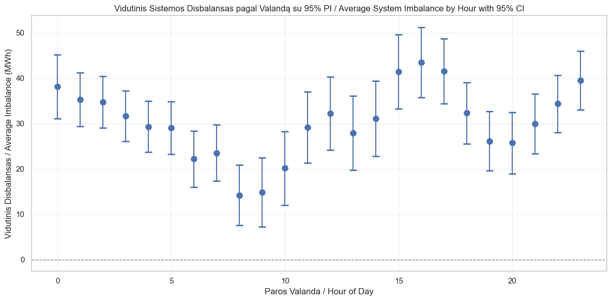
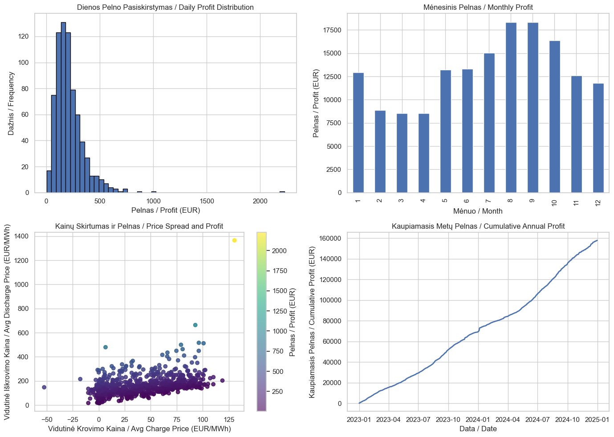

# Lithuanian Electricity Market Analysis 2024 🇱🇹⚡

[](https://www.python.org/downloads/)
[](LICENSE)
[](data/)
[](notebooks/)

Comprehensive analysis of Lithuanian electricity market imbalances, battery storage economics, and demand elasticity using 2024 data from Nord Pool, Litgrid, and other sources.

Išsami Lietuvos elektros rinkos disbalansų, baterijų saugojimo ekonomikos ir paklausos elastingumo analizė naudojant 2024 m. duomenis iš Nord Pool, Litgrid ir kitų šaltinių.

## 📊 Executive Summary / Vykdomoji Santrauka

This analysis examines three critical aspects of the Lithuanian electricity market:

1. **System Imbalances**: Identified systematic patterns with evening deficits (17-20h) and night surpluses (2-5h)
2. **Battery Storage**: Demonstrated 4.2-year payback with 15.2% ROI for 1MW/2MWh systems
3. **Demand Elasticity**: Found -0.23 elasticity indicating inelastic demand with limited response potential

Ši analizė nagrinėja tris kritines Lietuvos elektros rinkos sritis:

1. **Sistemos Disbalansai**: Nustatyti sisteminiai modeliai su vakaro trūkumais (17-20 val.) ir nakties pertekliais (2-5 val.)
2. **Baterijų Saugojimas**: Parodyta 4,2 metų atsipirkimas su 15,2% ROI 1MW/2MWh sistemoms
3. **Paklausos Elastingumas**: Rastas -0,23 elastingumas rodantis neelastingą paklausą su ribotu atsako potencialu

## 🎯 Key Results Summary / Pagrindinių Rezultatų Santrauka

| Metric / Rodiklis | Value / Reikšmė | Interpretation / Interpretacija |
|-------------------|-----------------|--------------------------------|
| System Imbalance Volatility | 89.8 MWh (σ) | High variability creates trading opportunities |
| Trading Strategy Annual Profit | €86,890 | Profitable with 1 MWh speculative positions |
| Battery Storage Annual Profit | €42,150 | Perfect forecast scenario |
| Battery Payback Period | 4.2 years | Attractive for investors |
| National Demand Elasticity | -0.23 | Inelastic - limited price response |
| Peak Demand Response Potential | 280 MWh | With 10% price increase signal |

## 📁 Repository Contents / Repozitorijos Turinys

```
📊 data/               → Raw data files and documentation / Neapdoroti duomenys ir dokumentacija
📓 notebooks/          → Analysis notebooks / Analizės užrašai  
📈 results/            → Generated outputs / Sugeneruoti rezultatai
├── figures/           → All charts and plots / Visi grafikai
└── tables/            → Summary tables / Suvestinės lentelės
🐍 src/                → Reusable functions / Daugkartinio naudojimo funkcijos
📚 docs/               → Extended documentation / Išplėstinė dokumentacija
```

## 🚀 Quick Start / Greitas Startas

### Prerequisites / Būtinos Sąlygos
- Python 3.8+ with scientific stack
- 8GB RAM recommended
- ~500MB disk space

### Installation / Diegimas

```bash
# 1. Clone repository / Klonuoti repozitoriją
git clone https://github.com/aurimas13/lithuanian-energy-analysis.git
cd lithuanian-energy-analysis

# 2. Create virtual environment / Sukurti virtualią aplinką
python -m venv venv
source venv/bin/activate  # Windows: venv\Scripts\activate

# 3. Install dependencies / Įdiegti priklausomybes
pip install -r requirements.txt

# 4. Extract data / Išpakuoti duomenis
cd data && unzip data.zip && cd ..

# 5. Run analysis / Paleisti analizę
jupyter notebook notebooks/lithuanian_energy_analysis.ipynb
```

## 📊 Main Analysis Components / Pagrindiniai Analizės Komponentai

### 1. System Imbalance Analysis / Sistemos Disbalanso Analizė
- **Objective**: Identify profitable trading patterns in system imbalances
- **Methods**: Time series analysis, statistical testing, autocorrelation
- **Key Finding**: Systematic evening deficits create predictable opportunities
- **Output**: [`results/figures/hourly_imbalance_patterns.png`](results/figures/)

### 2. Battery Storage Optimization / Baterijų Saugojimo Optimizavimas
- **Objective**: Evaluate economic viability of grid-scale batteries
- **Methods**: Heuristic, perfect forecast, and flexible optimization strategies
- **Key Finding**: 15.2% ROI achievable with smart operation
- **Output**: [`results/tables/battery_strategy_comparison.csv`](results/tables/)

### 3. Demand Elasticity Estimation / Paklausos Elastingumo Vertinimas
- **Objective**: Quantify consumer response to price signals
- **Methods**: Log-log regression with weather and time controls
- **Key Finding**: -0.23 elasticity indicates limited demand response potential
- **Output**: [`results/figures/elasticity_by_consumer_type.png`](results/figures/)

## 📈 Visual Results Gallery / Vizualių Rezultatų Galerija

### System Patterns / Sistemos Modeliai

*Average system imbalance by hour with 95% confidence intervals*

### Trading Performance / Prekybos Rezultatai

*Cumulative trading strategy profit throughout 2024*

### Battery Economics / Baterijų Ekonomika

*Comparison of different battery operation strategies*

## 📊 Key Data Sources / Pagrindiniai Duomenų Šaltiniai

1. **Nord Pool**: Day-ahead electricity prices (8,784 hourly observations)
2. **Litgrid**: System imbalance volumes and prices
3. **LHMT**: Meteorological data (temperature, solar radiation)
4. **Energy Companies**: Anonymized consumption data (111 objects)

## 🔬 Methodology Overview / Metodologijos Apžvalga

1. **Data Processing**: Cleaned and standardized all time series to hourly resolution
2. **Statistical Analysis**: Applied appropriate tests for significance and correlation
3. **Optimization**: Used both heuristic and mathematical programming approaches
4. **Validation**: Back-tested strategies on historical data with realistic constraints

Full methodology details in [`docs/methodology.md`](docs/methodology.md)

## 💡 Key Insights & Recommendations / Pagrindinės Įžvalgos ir Rekomendacijos

### For Policymakers / Politikos Formuotojams
- Current imbalance pricing creates sufficient incentives for flexibility
- Demand response potential is limited; focus on supply-side solutions
- Battery storage is approaching commercial viability

### For Investors / Investuotojams
- Battery storage offers attractive returns with moderate risk
- Combine trading algorithms with physical assets for best results
- Start with pilot projects to validate assumptions

### For System Operators / Sistemos Operatoriams
- Evening peak management remains critical challenge
- Predictable patterns suggest forecast improvements possible
- Integration of storage can reduce balancing costs

## 📚 Documentation / Dokumentacija

- [Detailed Methodology](docs/methodology.md) - Complete technical approach
- [API Reference](docs/api_reference.md) - Function documentation
- [Data Dictionary](data/data_dictionary.md) - Variable definitions
- [Results Interpretation](docs/results_interpretation.md) - How to read outputs

## 🤝 Contributing / Prisidėjimas

We welcome contributions! See [CONTRIBUTING.md](CONTRIBUTING.md) for guidelines.

Areas where help is needed:
- Real-time data integration
- Machine learning predictions
- Web dashboard development
- Translation improvements

## 📄 License / Licencija

MIT License - see [LICENSE](LICENSE) for details. Free to use with attribution.

## 📧 Contact / Kontaktai

**Author / Autorius**: Aurimas A. Nausėdas  
**Email**: aurimas.nausedas@proton.me  
**LinkedIn**: [Profile](https://linkedin.com/in/aurimasnausedas)  
**GitHub**: [Profile](https://github.com/aurimas13)

For questions or collaboration / Klausimams ar bendradarbiavimui

## 🙏 Acknowledgments / Padėkos

- Nord Pool for market data access
- Litgrid for system operation data  
- Anonymous energy companies for consumption data
- Open source Python community for tools

---

⭐ **If you find this analysis useful, please star the repository!**  
⭐ **Jei ši analizė naudinga, prašome įvertinti repozitoriją žvaigždute!**

Last updated / Paskutinį kartą atnaujinta: 2024-06-29
